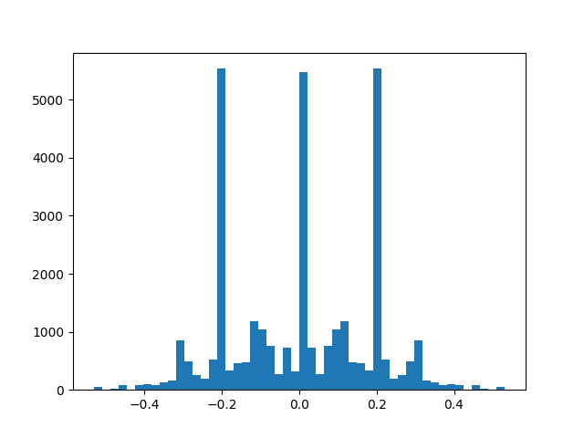

# Behaviorial Cloning Project

Overview
---

#### Track 1: https://youtu.be/Qs_IcKohh-w

In this project, we use a convolutional neural network (CNN) to train a self-driving through behavioral cloning.  

The model learns to steer based on the camera images and steering angle data collected from manually driving in the simulator.  

My project includes the follow files:

* model.py containing the script to create and train the model
* drive.py for driving the car in autonomous model
* model.h5 containing a trained convolution neural network

A video of the car driving successfully on track 1 in autonomous mode is provided in the link above.   

Model Architecture
---

I use Keras to implement the NVIDIA deep learning CNN model for self-driving cars.  More information about the NVIDIA model can be found here: https://arxiv.org/pdf/1604.07316v1.pdf.

In the first layer, the model  normalizes the data and augments the images to see just the road and the lane lines, removing unnecessary background visuals.  

The convolution layers perform feature extraction. The values are transferred from the NVIDIA design as they have been through many iterations of empirical testing.  There are five convolutional layers first consisting of a 5x5 kernel and 2x2 strides with ELU activation (model.py starting at line 58).  The last two convolutional layers uses a 3x3 kernel and 1x1 strides.  The model ends with three fully connected layers that controls steering.  

ELU (Exponential linear unit) is used instead or ReLU (Rectified linear unit) for non-linearity and reduction in bias, since ReLU outputs will always produce positive values for activation. ELU performed slightly better through thorough testing.   

Dropout is implemented once after flattening the convolutional layers (model.py line 64) and a second time between the fully connected layers (model.py line 67) to help reduce overfitting.  The values and structure for dropout was inspired by the commaai train steering model (https://github.com/commaai/research/blob/master/train_steering_model.py) which has shown improvements in my model.  

The model uses an adam optimizer, which uses an adaptive approach to apply a variable learning rate; thus having benefits of computational efficiency and minimal memory requirements (model.py line 71).

3 epochs were sufficient to train the model. The training and validation loss produced are very low in each epoch which indicates characteristics of overfitting.

Training Strategy
---

#### Initial Approach

It was first important to establish a working model then improvements could be made from there.  Out of several CNNs I've tested, the NVIDIA CNN has shown superior pattern recognition with the default training data provided.  

#### Data Collection

At this point I decided to record better and cleaner training data to help clone good driving behavior.  Through many iterations of testing data gathered, I found driving the car at low speeds helps record better angles for steering.  When driving at maximum speeds (30mph) the car doesn't need to steer as much because it covers much more of the track at a much faster pace.  It was also important to have very smooth steering on every turn so the model would have better a approach for every curve.  Using a controller axis to implement steering and throttle was a crucial factor to my success.  At this point I believe I could implement a very successful model with minimal data collection.  About 1.5 laps of data were captured with center steering, and some recovery steering and the rest of the data was augmented.  

#### Normalization

Since the model uses images to train pattern recognition, it was important to convert the colors to RGB from BGR in the normalization process.  This was done once the images were read via cv2 (model.py line 23).

#### Camera Angles

Center, Left and Right camera angles were used to help the model with pattern recognition (model.py starting at line 13).  A correction of +/- 0.2 was used to account for measurements in distortion.  

#### Generalization

To help the model generalize, the training images and measurements were flipped; thus doubling the amount of data collected (model.py starting at line 31).  The first track mainly consists of left turns. Therefore, by flipping the data we train the model to deal with right turns as well.  

Here is a visualization of the aggregate angles collected and augmented by the model.  

Evaluation
---

The NVIDIA deep learning CNN is a very powerful model that requires very minimal data to operate a self driving car successfully.  Given the simplistic design of track 1, it was very easy to train the model and drive in it successfully.  

However, if the car were to start off the road, I believe the current model won't have sufficient data to successfully recover.  To train this, additional data will be required.  Nevertheless, for all normal circumstances, the model is able to maintain the car in the center of the road at all times, albeit at slow speeds.
