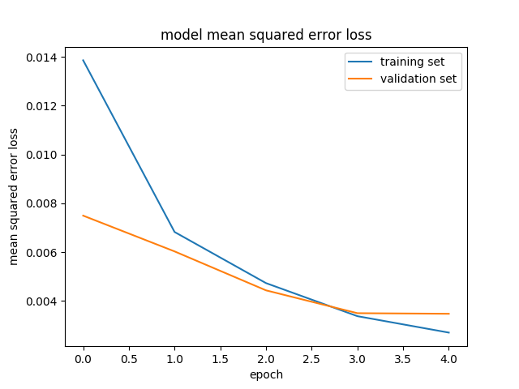
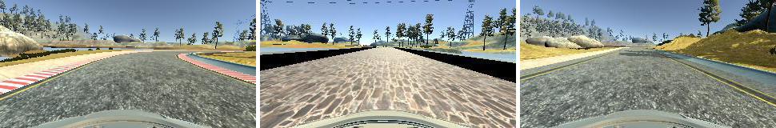
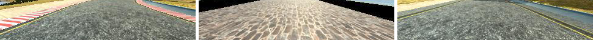
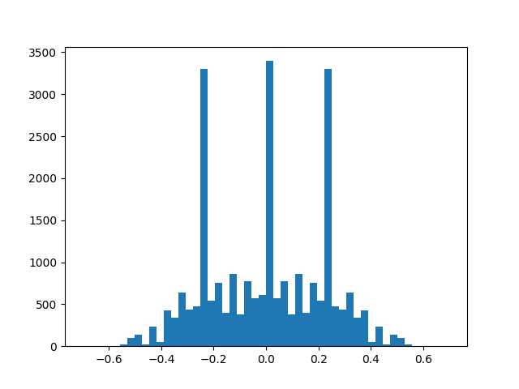

# Behaviorial Cloning Project

Overview
---

#### Track 1 Full Demonstration: https://youtu.be/Qs_IcKohh-w

In this project, we use a convolutional neural network (CNN) to train a self-driving through behavioral cloning.  

The model learns to steer based on the camera images and steering angle data collected from manually driving in the simulator.  

My project includes the following files:

* model.py containing the script to create and train the model
* drive.py for driving the car in autonomous model
* model.h5 containing a trained convolution neural network
* video.mp4 python generated video of the simulator

Recommended simulator settings to run the model:
* Screen resolution: 1280 x 960 (Windowed)
* Graphics quality: Fantastic

Simulator: https://github.com/udacity/self-driving-car-sim

Model Architecture
---

 Layer            | Feature     |Kernel Size| Strides | Activation | Padding| Type |
------------------|-------------|-----------|---------|------------|--------|------|
**Input**         |(160,320,3)  |           |         |            |        |Input
**Normalization** |Lambda       |           |         |            |        |Preprocess
**Cropping2D**    |(65,15),(0,0)|           |         |            |        |Preprocess
**Convolution2D** |Filter: 24   |    5x5    |   2x2   |   elu      |   Same |Convolutional
**Convolution2D** |Filter: 36   |    5x5    |   2x2   |   elu      |   Same |Convolutional
**Convolution2D** |Filter: 48   |    5x5    |   2x2   |   elu      |   Same |Convolutional
**Convolution2D** |Filter: 64   |    3x3    |   None  |   elu      |   Same |Convolutional
**Convolution2D** |Filter: 64   |    3x3    |   None  |   elu      |   Same |Convolutional
**Flatten**       |             |           |         |            |        |
**Dropout**       |0.2          |           |         |            |        |
**Dense**         |Neurons: 100 |           |         |            |        |Fully Connected
**Dense**         |Neurons: 50  |           |         |            |        |Fully Connected
**Dropout**       |0.5          |
**Dense**         |Neurons: 10  |           |         |            |        |Fully Connected
**Dense**         |Neurons: 1   |           |         |            |        |Output

I use Keras to implement the NVIDIA deep learning CNN model for self-driving cars.  More information about the NVIDIA model can be found here: https://arxiv.org/pdf/1604.07316v1.pdf.

In the first layer (model.py line 73-74), the model  normalizes the data and augments the images to visualize the road and the lane lines, removing unnecessary background visuals.  

The convolution layers perform feature extraction. The values are transferred from the NVIDIA design as they have been through many iterations of empirical testing.  There are five convolutional layers first consisting of a 5x5 kernel and 2x2 strides with ELU activation.  The last two convolutional layers uses a 3x3 kernel and 1x1 strides.  The model ends with three fully connected layers that controls steering.  

We apply ReLU (Rectified linear unit) activation for each convolutional layer to introduce non-linearity and reduction in bias, ReLU outputs will always produce positive values for activation. ELU (Exponential linear unit) may also be used in place of ReLU if negative output activation is desired.   

Dropout is implemented once after flattening the convolutional layers and a second time between the fully connected layers to help prevent overfitting.  The values and structure for dropout was inspired by the commaai train steering model (https://github.com/commaai/research/blob/master/train_steering_model.py) which has shown improvements in my model.  

Implementing dropout between the convolutional layers made the model underperform by quite a bit.  I've tried adjusting it with different parameters, adding new data and testing various epochs and iterations of other parameters but the model still did not seem to perform optimally.  

The model uses an adam optimizer (model.py line 88), which uses an adaptive approach to apply a variable learning rate; thus having benefits of computational efficiency and minimal memory requirements.

Four epochs were chosen train the model because there was significant dimininishing returns in the improvement of loss anything beyond.  The loss of the validation and training set also begins to converge at this point and flattens indicating maximum performance.  

Increasing the epochs can introduce unwanted overfitting of the model as the validation loss begins to rise after around 4 epochs as illustrated in this figure:

Training Strategy
---

#### Initial Approach

It's important to first establish a working neural network, then improvements and adjustments can be carefully made from there.  Out of several CNNs I've tested, the NVIDIA CNN has shown superior pattern recognition with the default training data provided.  

#### Data Collection

At this point I learned that it was very important record better and cleaner training data to help clone good driving behavior.  Through many iterations of testing data gathered, I found driving the car at low speeds helps record better angles for steering.  When driving at maximum speeds (30mph) the car doesn't need to steer as much because it covers much more of the track at a much faster pace.  It was also important to have very smooth steering on every turn so the model would have better a approach for every curve.  Using a controller axis to implement steering and throttle was a crucial factor to my success.  Having too much data going straight would over-train the model to go straight.  Thus, its important to have quality data which can be increased with augmentation.  Laps of the track was recorded clockwise and counterclockwise including laps with recovery steering.

#### Normalization

Since the model uses images to train pattern recognition, it was important to convert the colors to RGB from BGR in the normalization process.  

#### Camera Angles

Center, Left and Right camera angles were used to help the model with pattern recognition (model.py starting at line 26).  A correction of +/- 0.2 was used to account for measurements in distortion.  

#### Generalization

To help the model generalize, the training images and measurements were flipped and added to the data set; thus doubling the amount of data collected.  The first track mainly consists of left turns. Therefore, by flipping the data we train the model to learn to approach right turns as well.  

#### Visualization

Examples of camera image captured and recorded by the simulator:

Cropped visualization of camera image processed for input:

Steering angles distribution including augmentation:

Evaluation
---

The NVIDIA deep learning CNN is a very powerful model that requires very minimal data to operate a self driving car successfully.  Given the simplistic design of track 1, it wasn't too difficult to train the model and drive in it successfully.  

However, the model is only as good as how you train it, meaning, with poor data (bad driving behavior) or significant bias in steering angles (having too much data going straight), the model would learn to drive poorly or go straight too much even during turns.  To alleviate this issue, we may implement data processing techniques to aim for a more even distriubtion of steering angles, throttle control and breaking patterns.  
